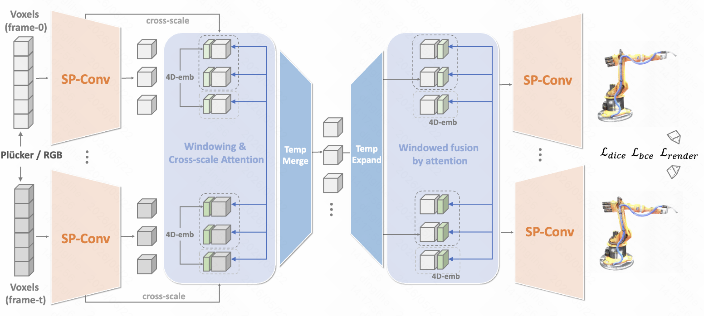

[comment]: <> (# Native Spatio-temporal 4D Variational AutoEncoder)

  <h1 align="center">Native Spatio-temporal 4D Variational AutoEncoder</h1>

[comment]: <> (  <h2 align="center">PAPER</h2>)
  <h3 align="center"><a href="https://arxiv.org/abs/x">Paper</a> | <a href="https://native4d.github.io/">Project Page</a></h3>
  

---

## NEWS
- 🔥 Native4D-VAE got accepted by ICML26.
- Stay tuned.
